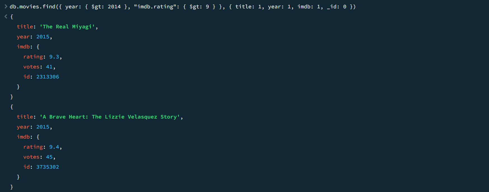

# Assignment-5
MongoDB Assignment for Topics In Computer Science I

In this assignment, two queries are made in the MONGOSH terminal using MongoDB Compass. This assignment utilizes a database containing movies and information pertaining to them. The first query serves to find movies that were filmed in 1983 and having a runtime greater than 200 minutes. The second query serves to find movies in 2014 that have an imdb rating greater than 9.

